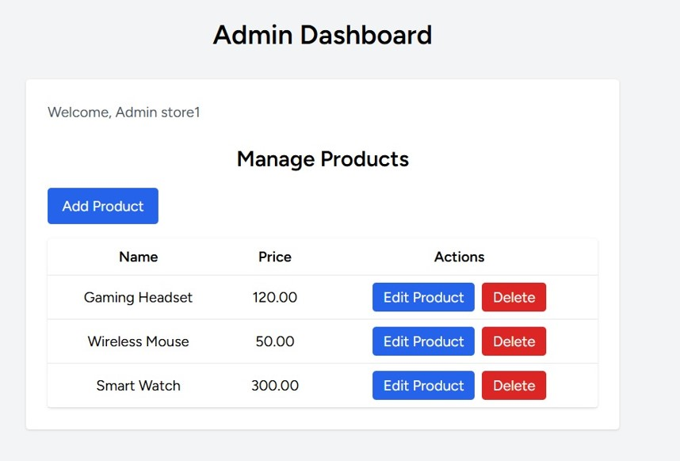
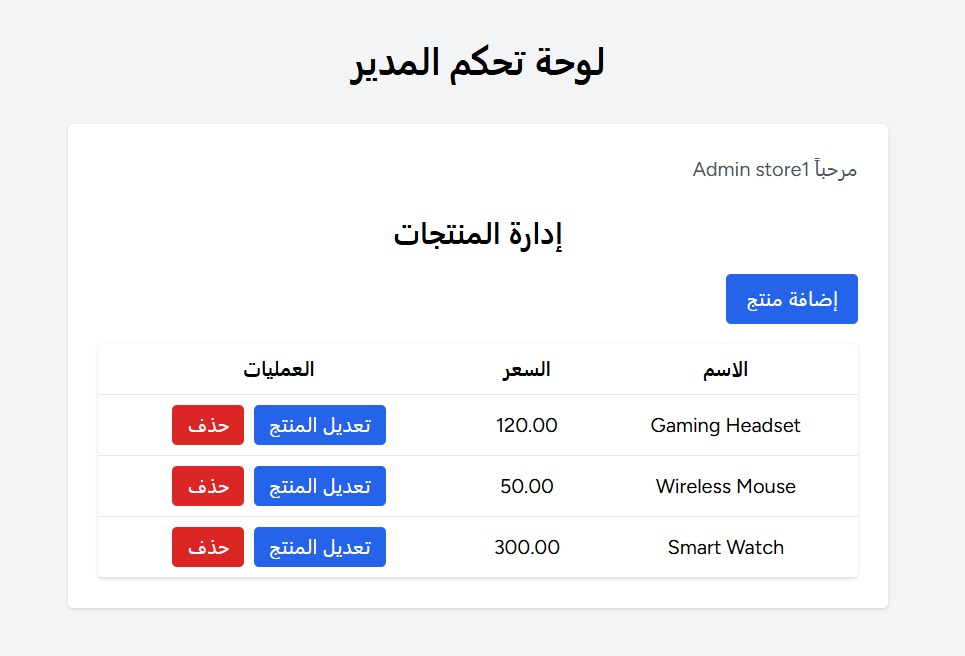
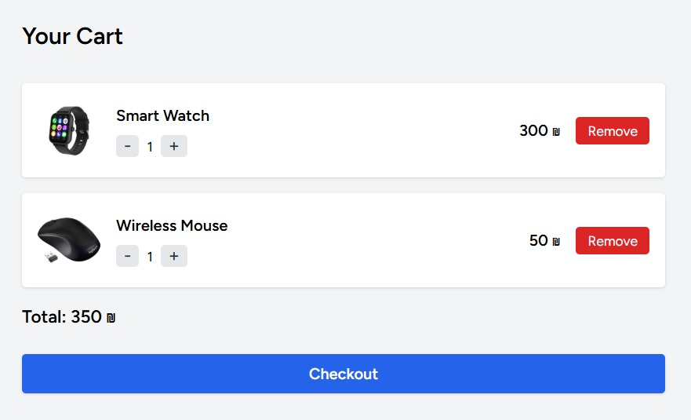
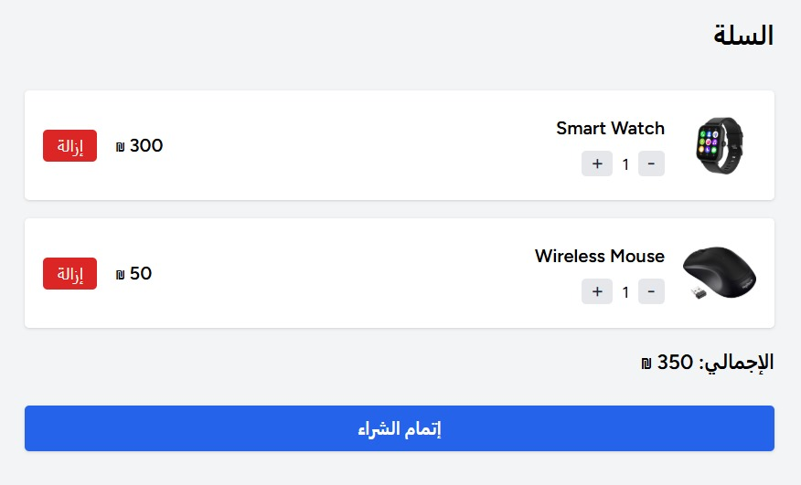
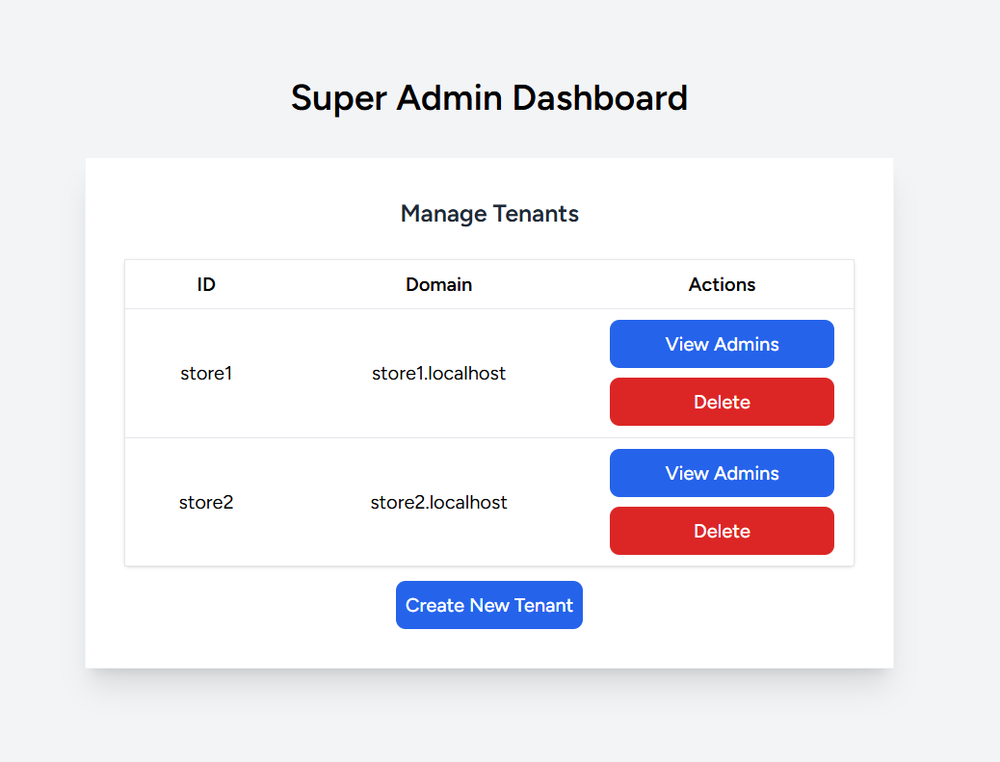

# Electronics Multi-Tenant Market

This is a Laravel 12 multi-tenant e-commerce project using [stancl/tenancy](https://tenancyforlaravel.com/).  
The system allows running **multiple stores** (tenants) on different subdomains, with a central market homepage for choosing a store.  
Each store has its own products and an admin panel to manage them.

## Features

- **Central Market Homepage:**  
  `/` on the main domain (e.g. `127.0.0.1:8000`) lists all available stores and lets users choose which store to visit.

- **Multiple Tenants (Stores):**  
  Each store has its own subdomain, e.g. `store1.localhost:8000`, `store2.localhost:8000`, etc.

- **Dynamic Store List:**  
  The homepage fetches all tenants dynamically from the tenants table.

- **Admin Dashboard (per store):**  
  Each store has its own admin dashboard accessible by store admins only, where they can manage products.

- **Product Management:**  
  Store admins can create, edit, delete, and list products for their own store only.

- **Super Admin Dashboard:**  
  Platform owner can manage tenants, domains, and store admins centrally.

- **Multi-Language Support:**  
  The platform supports full localization in **English** and **Arabic**. Users can easily switch between languages at any time, and all pages (including admin dashboards and store front) are translated.

---

## Setup Instructions

1. **Clone the repo and install dependencies:**
    ```bash
    git clone https://github.com/aseelmujahed/electronics-store.git
    cd electronics-store
    composer install
    npm install && npm run build
    ```

2. **Configure `.env`**
    - Set up your database connection.

3. **Run migrations and seeders:**
    ```bash
    php artisan migrate --seed
    ```

4. **Start the server:**
    ```bash
    php artisan serve
    ```
    Visit [http://127.0.0.1:8000](http://127.0.0.1:8000) for the central market homepage.

---

## Multi-Language Support

The platform includes **full support for multiple languages** (currently English and Arabic).  
You can easily switch the interface language using the language selector at the top of each page.

### **Demo: English & Arabic Interface**

<p align="center">
  
  
</p>

<p align="center">
  
  
</p>

---

## Super Admin Dashboard

A dedicated **Super Admin Dashboard** is available for the platform owner to manage all tenants (stores) in the system.

**Super Admin** can:
- View all tenants (stores) and their domains.
- Create new tenants and assign admin accounts to them.
- Delete tenants.
- Manage store admins for each tenant (add/delete).

**Accessing Super Admin Dashboard:**

- **URL:**  [http://127.0.0.1:8000/super-admin](http://127.0.0.1:8000/super-admin)

- **Demo Super Admin Account:**  
    - **Email:** `superadmin@gmail.com`  
    - **Password:** `superadmin`  

---

## Admin Dashboard (per store)

To access the **Admin Dashboard** for each store, use the following demo accounts:

| Store    | Admin Email              | Password        |
|----------|--------------------------|-----------------|
| store1   | adminstore1@gmail.com    | adminstore1     |
| store2   | adminstore2@gmail.com    | adminstore2     |

---

## Screenshots

### 1. Central Market Homepage


### 2. Store Homepage


### 3. Cart


### 4. Super Admin Dashboard


### 5. Admin Dashboard


## Credits

- Laravel 12
- [stancl/tenancy](https://tenancyforlaravel.com/)
- [Tailwind CSS](https://tailwindcss.com/)
- Livewire
