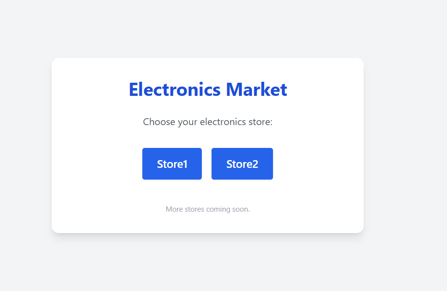
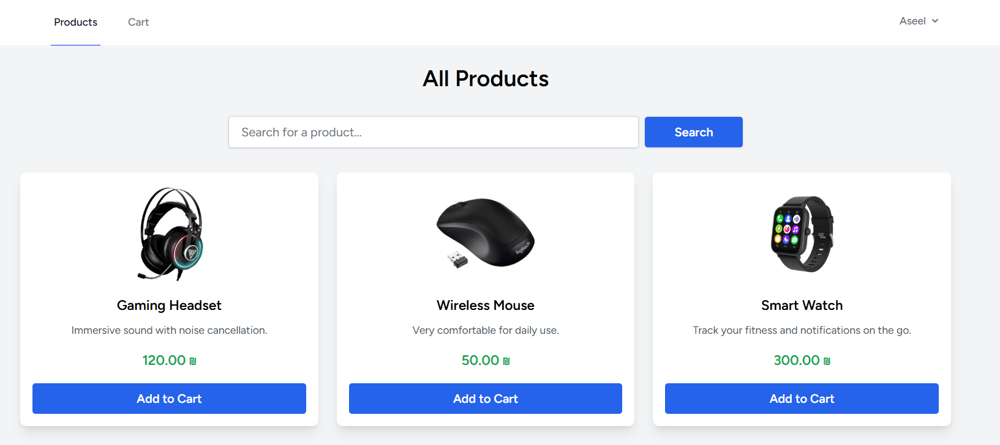
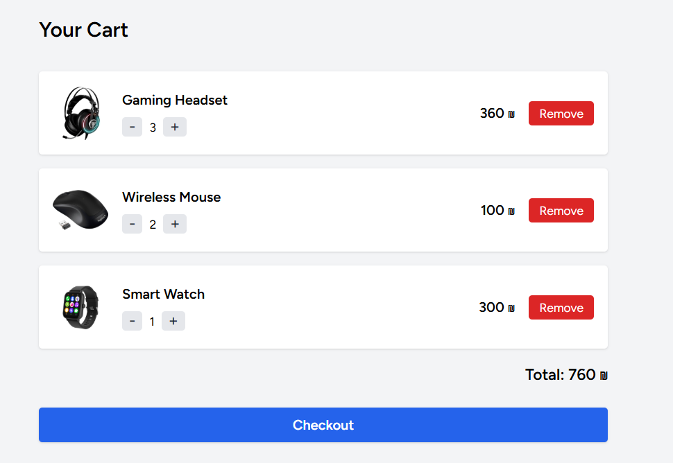
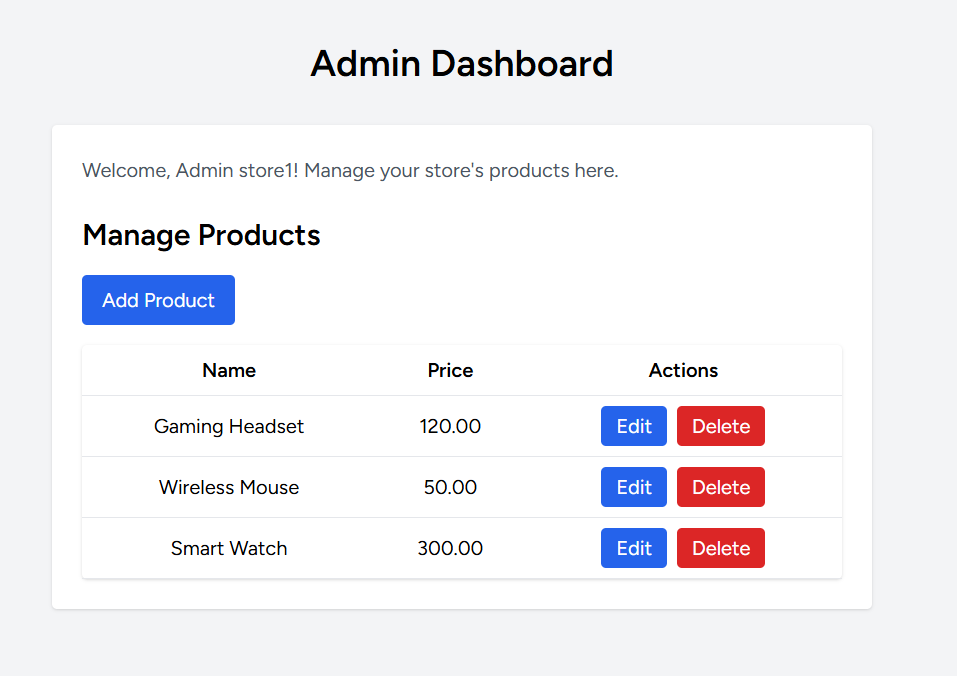

# Electronics Multi-Tenant Market

This is a Laravel 12 multi-tenant e-commerce project using [stancl/tenancy](https://tenancyforlaravel.com/).  
The system allows running **multiple stores** (tenants) on different subdomains, with a central market homepage for choosing a store.  
Each store has its own products and an admin panel to manage them.

## Features

- **Central Market Homepage:**  
  `/` on the main domain (e.g. `127.0.0.1:8000`) lists all available stores and lets users choose which store to visit.

- **Multiple Tenants (Stores):**  
  Each store has its own subdomain, e.g. `store1.localhost:8000`, `store2.localhost:8000`, etc.

- **Dynamic Store List:**  
  The homepage fetches all tenants dynamically from the tenants table.

- **Admin Dashboard (per store):**  
  Each store has its own admin dashboard accessible by store admins only, where they can manage products.

- **Product Management:**  
  Store admins can create, edit, delete, and list products for their own store only.

## Setup Instructions

1. **Clone the repo and install dependencies:**
    ```bash
    git clone ...
    composer install
    npm install && npm run build
    ```

2. **Configure `.env`**
    - Set DB connection.

3. **Run migrations and seeders:**

    ```bash
    php artisan migrate --seed
    ```

4. **Start the server:**
    ```bash
    php artisan serve
    ```
    Visit [http://127.0.0.1:8000](http://127.0.0.1:8000) for the central market homepage.

5. **Admin Dashboard:**  

   To access the **Admin Dashboard** for each store, use the following demo accounts:

    | Store    | Admin Email              | Password        |
    |----------|--------------------------|-----------------|
    | store1   | adminstore1@gmail.com    | adminstore1     |
    | store2   | adminstore2@gmail.com    | adminstore2     |

- Each admin is restricted to their own store and cannot access other stores’ dashboards.

## Credits

- Laravel 12
- [stancl/tenancy](https://tenancyforlaravel.com/)
- [Tailwind CSS](https://tailwindcss.com/)
- Livewire 

## Screenshots

### 1. Central Market Homepage


### 2. Store Homepage


### 3. Cart


### 4. Admin Dashboard

